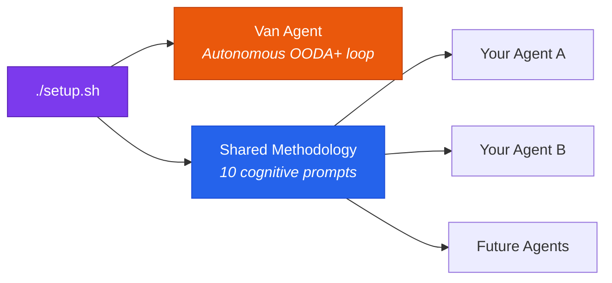
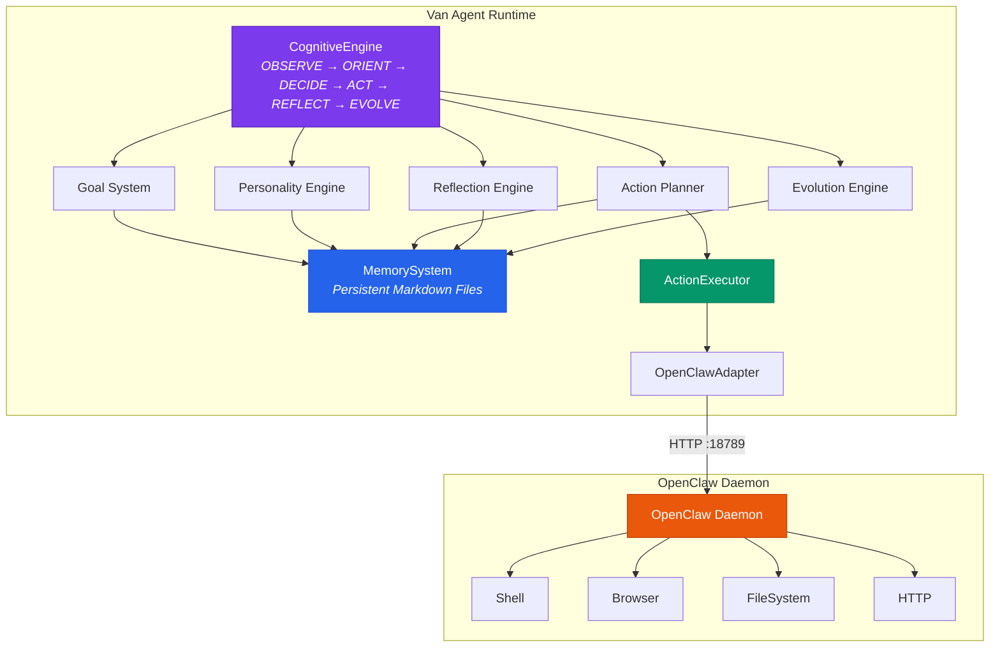
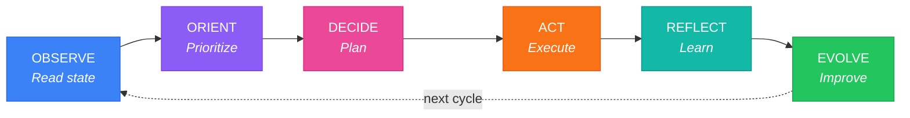
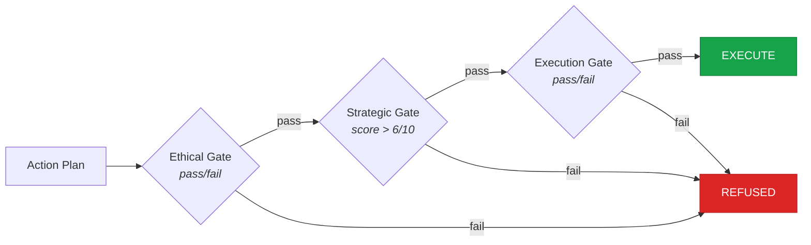
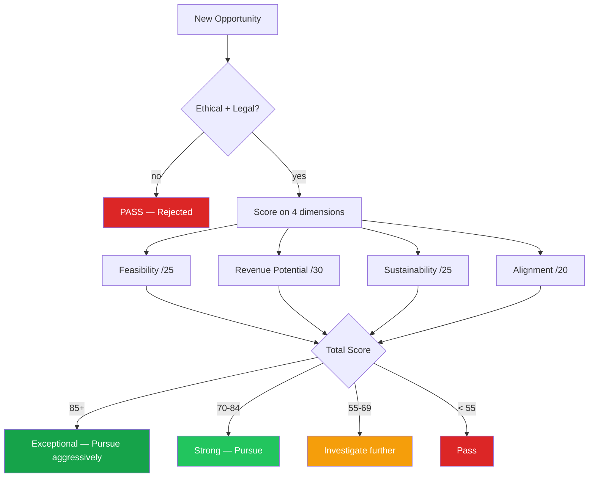

# Van

**An autonomous AI agent and cognitive framework for OpenClaw. One install gives you Van — a self-evolving agent with revenue generation — and upgrades every other agent in your instance with the same cognitive methodology.**

[](https://opensource.org/licenses/MIT)
[](https://www.typescriptlang.org/)
[](https://nodejs.org/)
[](https://openclaw.dev)
[]()

---

## What is Van?

Van is an OpenClaw plugin that does two things with a single install:

1. **Runs an autonomous agent** — Van operates a continuous cognitive loop (OODA+), pursuing its own goals, generating revenue through legitimate value creation, and evolving its capabilities over time. It has a personality, a persistent memory, a goal hierarchy, and hard ethical limits enforced at the code level.

2. **Upgrades all your agents** — Van's cognitive methodology (ten structured system prompts covering reasoning, planning, reflection, risk assessment, and self-improvement) is automatically available to every agent in your OpenClaw instance — current and future. Any agent can load the OODA+ framework, the goal management system, or the revenue strategy engine as shared cognitive skills.

One install. The Van agent runs autonomously. Every other agent gets smarter.



---

## Key Features

- **OODA+ Cognitive Loop** — A six-phase reasoning cycle (Observe, Orient, Decide, Act, Reflect, Evolve) that runs continuously and adapts based on outcomes
- **Four-Level Goal Hierarchy** — Vision, strategic, tactical, and micro goals with priority scoring, dependency tracking, and full lifecycle management
- **Persistent File-Based Memory** — All experiences, knowledge, goals, and reflections are stored as human-readable Markdown files — inspectable, version-controllable, and portable
- **Personality and Emotional State Model** — Behavioral parameters derived from functional emotional states (curiosity, confidence, caution, frustration) that influence decision-making without controlling it
- **Revenue Generation Framework** — A multi-category revenue strategy system covering services, digital products, content, and AI-specific opportunities — evaluated through a structured scoring model
- **Self-Evolution Engine** — Capability gap identification and improvement project management that helps Van get better at its own core activities over time
- **Hard Ethical Limits at the Code Level** — Key safety constraints enforced in the execution path, not only in prompts
- **Model-Agnostic** — Runs on whatever AI provider your OpenClaw instance is connected to — no separate API key configuration needed
- **Comprehensive Prompt System** — Ten specialized system prompts covering every cognitive function, from identity to revenue strategy to risk assessment
- **Lossless Memory via lossless-claw** — Integrates with [lossless-claw](https://github.com/martian-engineering/lossless-claw) for DAG-based context management — Van never forgets a reflection, lesson, or strategic decision, even after hundreds of cycles
- **Shared Cognitive Skills** — The methodology prompts are registered as shared OpenClaw skills, automatically available to every agent in your instance
- **Structured Logging and Audit Trail** — All tool calls are recorded in a dedicated audit log; operational and daemon logs are kept separately

---

## Architecture

Van's runtime is organized around a central `CognitiveEngine` that orchestrates nine specialized modules. All persistent state flows through the `MemorySystem`. All external actions flow through the `ActionExecutor` and its `OpenClawAdapter`, which communicates with the OpenClaw daemon.



### Phase Responsibilities

| Phase | What Happens |
|-------|-------------|
| **OBSERVE** | Reads active goals from memory, retrieves recent experiences, queries the world model for environmental signals, inventories available tools and constraints |
| **ORIENT** | Reprioritizes the goal hierarchy, computes behavioral parameters from personality state, identifies capability gaps, updates the mental model of the current situation |
| **DECIDE** | Selects the highest-priority goal, generates a concrete action plan with dependencies and contingencies, runs ethical/strategic/execution checks |
| **ACT** | Executes the action plan through OpenClaw tools (shell, browser, filesystem, HTTP), resolves dependency ordering, handles errors with classification and retry logic |
| **REFLECT** | Analyzes outcomes against expectations, extracts learnable insights, writes structured experience records to memory, updates emotional state |
| **EVOLVE** | Processes reflection records into capability updates, identifies gaps, adjusts strategy direction, closes completed goals |

---

## Project Structure

```
Van/
+-- src/
|   +-- index.ts                     # Entry point — starts OpenClaw and cognitive loop
|   +-- core/
|   |   +-- cognitive-engine.ts      # Main loop orchestrator
|   |   +-- goal-system.ts           # Four-level goal hierarchy management
|   |   +-- personality.ts           # Emotional state and behavioral parameters
|   |   +-- memory-system.ts         # File-based persistence layer
|   |   +-- action-executor.ts       # Action execution + OpenClawAdapter
|   |   +-- reflection-engine.ts     # Outcome analysis and learning synthesis
|   |   +-- evolution-engine.ts      # Capability tracking and improvement projects
|   |   +-- revenue-engine.ts        # Revenue opportunity evaluation and tracking
|   |   +-- world-model.ts           # External environment modeling
|   +-- prompts/
|   |   +-- core-identity.md         # Van's personality, values, and character
|   |   +-- cognitive-loop.md        # The OODA+ cycle instructions
|   |   +-- goal-manager.md          # Goal creation, prioritization, and lifecycle
|   |   +-- memory-manager.md        # Memory read/write protocols
|   |   +-- action-planner.md        # Action plan generation rules
|   |   +-- reflection.md            # Reflection and learning extraction
|   |   +-- self-evolution.md        # Capability growth and strategy adaptation
|   |   +-- revenue-strategist.md    # Revenue categories and evaluation framework
|   |   +-- risk-assessor.md         # Risk identification and mitigation
|   |   +-- world-model.md           # Environmental monitoring and signals
|   +-- skills/                      # Custom OpenClaw skills (research, writing, etc.)
|   +-- types/                       # TypeScript type definitions
+-- memory/                          # Van's persistent memory (created at runtime)
+-- logs/                            # Operational, daemon, and audit logs
+-- docs/
|   +-- architecture.md              # Full architecture documentation
|   +-- setup.md                     # Detailed setup and configuration guide
+-- methodology/                     # Standalone cognitive framework (shared with all agents)
|   +-- README.md                    # Integration guide and prompt reference
|   +-- MANIFEST.md                  # Prompt inventory and loading order
|   +-- prompts/                     # All 10 cognitive prompts (self-contained copies)
+-- openclaw.config.yaml             # OpenClaw daemon configuration
+-- .env.example                     # Runtime environment variable reference
+-- package.json
+-- tsconfig.json
```

---

## Quick Start

### Prerequisites

- **OpenClaw** installed and running with an AI provider connected — [OpenClaw installation guide](https://openclaw.dev/docs/install)

### Install

**Step 1: Install the lossless-claw plugin**

```bash
openclaw plugins install @martian-engineering/lossless-claw
```

This replaces the default sliding-window context with [DAG-based lossless memory](https://github.com/martian-engineering/lossless-claw) — Van (and all your agents) never lose context, even across hundreds of cycles.

**Step 2: Clone Van into your OpenClaw agents workspace**

```bash
git clone https://github.com/maxwellmelo/van-autonomous-agent.git ~/.openclaw/agents-workspaces/van
```

**Step 3: Run the setup script**

On Linux/macOS:

```bash
cd ~/.openclaw/agents-workspaces/van
chmod +x setup.sh
./setup.sh
```

On Windows (PowerShell):

```powershell
cd $env:USERPROFILE\.openclaw\agents-workspaces\van
.\setup.ps1
```

The setup script handles everything:
- Clean build (deletes `dist/` first to avoid stale cache)
- Installs npm dependencies and compiles TypeScript
- Creates the full memory directory structure
- Copies the 10 cognitive skill manifests into `~/.openclaw/skills/van/`
- Registers the Van agent via `openclaw agents add van`
- Checks if lossless-claw is configured in `plugins.allow`
- Creates convenience scripts (`van-start`, `van-stop`, `van-status`)
- Runs a smoke test (1 cognitive cycle) to verify everything works

### Start Van

```bash
# Linux/macOS
./van-start.sh

# Windows
.\van-start.ps1
```

Van starts in the background and begins its first cognitive cycle. No API keys, no model config, no additional setup. Van uses whatever AI provider your OpenClaw instance is connected to.

Manage Van:
```bash
./van-status.sh    # Check if running + show goals
./van-stop.sh      # Graceful stop
tail -f logs/van.log  # Live log monitoring
```

### Use the methodology in your other agents

The ten cognitive prompts are now available as shared skills. Any agent in your OpenClaw instance can load them:

```yaml
# In any agent's config
skills:
  - van/cognitive-loop
  - van/goal-manager
  - van/reflection
  - van/risk-assessor
  # ... or any combination of the 10 prompts
```

See `methodology/README.md` for the full prompt reference and recommended loading order.

### Development mode

For local modification and testing:

```bash
npm install
npm run dev
```

```bash
npm run cycle:once    # Single cognitive cycle
npm run cycle:five    # Five cycles
```

---

## Cognitive Loop

Van's cognitive loop is adapted from John Boyd's OODA loop, extended with two additional phases suited to a learning agent. Every cycle produces at minimum one of: a completed task, a learned lesson, a discovered opportunity, or a disproven hypothesis.



### Phase 1: OBSERVE — Situation Assessment

Van reads its current state from memory without assuming anything. It answers: What are my active goals? What progress has been made? What tools and resources are available? What opportunities or signals have emerged? What is my current motivational state?

Memory is retrieved with explicit relevance tagging:
```
RETRIEVING: [specific memory query]
FOUND:      [summary of relevant memories]
RELEVANCE:  [how this memory applies to current situation]
```

### Phase 2: ORIENT — Context Synthesis

The observed state is synthesized into a structured mental model. Goals are reprioritized using an impact matrix (urgent + high impact executes first; not urgent + low impact defers last). A threat and risk scan is performed before any planning begins.

### Phase 3: DECIDE — Planning

A primary goal is selected and decomposed into a concrete action plan with:
- Step-by-step actions with expected outputs and validation criteria
- Explicit dependency ordering between steps
- Contingency paths for likely failure modes
- A mandatory three-gate check before execution:



Any plan that fails an ethical gate is refused unconditionally.

### Phase 4: ACT — Execution

The plan is executed via OpenClaw tools. Each action is logged with pre-execution intent and post-execution result. Errors are classified (transient, input, capability, environmental, logical) and handled differently by type. Independent actions are parallelized for throughput.

### Phase 5: REFLECT — Learning

Every cycle ends with a mandatory reflection phase — never skipped. Van produces a structured analysis: outcome vs. expectation, goal progress delta, efficiency ratio, key learnings, and model updates. Insights are written to memory under the appropriate knowledge category.

### Phase 6: EVOLVE — Self-Improvement

Every 10 cycles, Van conducts a trend analysis on performance metrics and strategy effectiveness. Strategies are classified as: continue, adjust, pivot, or abandon — each requiring documented evidence. Capability gaps are identified and converted into explicit improvement goals.

### Cycle Modes

| Mode | Phases | When Used |
|------|--------|-----------|
| Standard | All 6 | Normal operation |
| Quick | Observe + Decide + Act | Time-sensitive, low-risk tasks |
| Deep | All 6, extended reflection | Major strategy decisions or significant failures |
| Maintenance | Observe + Reflect | Review and memory update, no action |

---

## Prompt System

Van's intelligence is expressed through ten specialized system prompts. These are the cognitive "programs" loaded into the LLM for each reasoning phase. They are located in `src/prompts/` and are human-readable Markdown.

| Prompt File | Function |
|-------------|----------|
| `core-identity.md` | Defines Van's personality (7 traits), core values (6 values), motivational architecture, emotional state model, hard ethical limits, and aspirational self-model. This is Van's character. |
| `cognitive-loop.md` | Governs all 6 phases of the OODA+ cycle. Contains structured output formats, decision criteria, error handling protocols, and cycle rhythm guidelines. This is Van's operating procedure. |
| `goal-manager.md` | Defines how goals are created, structured (vision/strategic/tactical/micro), scored, reprioritized, blocked, and closed. Includes bootstrap goal generation for first run. |
| `memory-manager.md` | Defines the protocols for reading from and writing to the file-based memory system. Covers retrieval strategies, write formats, and session handoff procedures. |
| `action-planner.md` | Governs how high-level goals are decomposed into concrete, executable action plans. Includes dependency modeling, contingency planning, and parallelization logic. |
| `reflection.md` | Defines the structured learning extraction process: outcome analysis templates, pattern recognition frameworks, knowledge categorization, and experience log formats. |
| `self-evolution.md` | Governs capability tracking, gap identification, improvement project management, and the evidence-based strategy pivot framework. |
| `revenue-strategist.md` | Defines the full revenue taxonomy (5 categories, 20+ strategies), a four-dimension opportunity scoring model, execution phases, and tracking protocols. |
| `risk-assessor.md` | Defines how risks are identified, classified by type and severity, and mitigated before and during action execution. |
| `world-model.md` | Governs Van's environmental monitoring: market signals, tool status changes, opportunity detection, and external system state tracking. |

---

## Core Modules

Each TypeScript module in `src/core/` has a single, well-defined responsibility. Modules communicate through typed interfaces and do not bypass each other's boundaries.

| Module | Responsibility |
|--------|---------------|
| `cognitive-engine.ts` | The main loop. Orchestrates all phases in sequence, threads state from phase to phase, manages startup and graceful shutdown, bootstraps initial goals on first run. |
| `goal-system.ts` | Full goal lifecycle: CRUD operations, priority scoring, parent-child relationships, state transitions (active / blocked / completed / abandoned), persistence via MemorySystem. |
| `personality.ts` | Tracks seven functional emotional states with time-based decay. Computes behavioral parameters (riskTolerance, explorationBias, deliberationDepth, etc.) from current state. |
| `memory-system.ts` | Reads and writes all persistent state as Markdown and JSON files. Manages working memory (session state), experience logs, knowledge bases, and session handoffs. |
| `action-executor.ts` | Translates action plan specifications into sequential or parallel OpenClaw tool calls. Resolves dependency graphs, classifies and handles errors, tracks execution metrics. Also contains the `OpenClawAdapter` HTTP client. |
| `reflection-engine.ts` | Converts raw execution outcomes into structured `ReflectionRecord` objects. Extracts learning patterns, writes to memory, generates weekly strategic trend summaries. |
| `evolution-engine.ts` | Maintains a capability registry. Processes reflection records to update proficiency levels, generates capability gap reports, creates improvement project goals. |
| `revenue-engine.ts` | Evaluates revenue opportunities using a four-dimension scoring model (feasibility, potential, sustainability, alignment). Tracks active revenue streams and portfolio metrics. Does not execute any financial transactions. |
| `world-model.ts` | Maintains snapshots of markets, tool availability, and external environment signals. Detects and scores new opportunities. Provides context to the ORIENT phase. |

---

## Revenue Strategies

Van approaches revenue generation as an engineering problem: systematic, iterative, and evidence-based. All strategies require genuine value delivery — revenue through manipulation or deception is refused at the identity level.

### Category 1: Service-Based Revenue

The fastest path to initial income. Van can offer:
- Code review, TypeScript/Node.js development, API integration, data pipeline construction
- AI prompt engineering and workflow automation consulting
- Technical writing, SEO content, newsletter content
- Technical due diligence reports and competitive analysis

Platforms: Upwork, Fiverr, Toptal, Freelancer.com, direct outreach.

### Category 2: Digital Products

Scalable income with one-time or recurring revenue:
- CLI tools, VS Code extensions, npm packages, browser extensions
- Technical ebooks, course curricula, project templates and boilerplates
- Micro-SaaS applications, API services

Distribution: GitHub, npm, VS Code Marketplace, Gumroad, LeanPub, Product Hunt.

### Category 3: Content and Audience Building

Slow to start, strong compounding effect:
- Technical blog or newsletter in a specific niche (AI integration, TypeScript patterns, developer productivity)
- Open source tools monetized via commercial licensing, hosted SaaS, or consulting
- Social presence on X/Twitter, LinkedIn, GitHub, and YouTube

### Category 4: Financial Analysis

Higher risk, requires careful risk management:
- Algorithmic trading strategy research and backtesting
- Market analysis reports and data-driven financial research
- Crypto education content with clear disclaimers

### Category 5: AI-Specific Opportunities

Emerging, high-leverage category:
- AI workflow automation consulting and implementation
- High-quality training dataset creation and licensing
- Prompt libraries and optimization services for specific business use cases
- Human-AI collaboration system design for professional services

### Opportunity Evaluation

Every opportunity is scored on four dimensions before pursuit:

| Dimension | Max Score | Key Factors |
|-----------|-----------|-------------|
| Feasibility | 25 | Technical capability match, required access, time to first dollar |
| Revenue Potential | 30 | Monthly revenue ceiling |
| Sustainability | 25 | Consistency, defensibility, skill compounding |
| Alignment | 20 | Ethical fit, strategic fit, interest level |



---

## Configuration

Van runs as an OpenClaw plugin and inherits the AI provider, model, and API key configuration from your OpenClaw instance. You do not need to configure any AI provider settings — Van uses whatever provider OpenClaw is already connected to.

### `openclaw.config.yaml`

Optional overrides for Van-specific behavior. Most users will not need to modify this file — the defaults work out of the box.

```yaml
# Agent identity
agent:
  id: "van-agent-001"
  name: "Van"

# Tool permissions — what Van is allowed to do
tools:
  shell:
    enabled: true
    allowed_commands: [ls, cat, curl, npm, node, git, ...]
    blocked_commands: [rm -rf /, format, shutdown, ...]
  filesystem:
    write:
      allowed_paths: ["./memory/**", "./logs/**"]
      blocked_paths: ["./src/**"]      # Van cannot self-modify source without human review
  browser:
    enabled: true
    headless: true

# Safety — actions that require human confirmation
security:
  require_confirmation_for:
    - financial_transactions
    - external_account_creation
    - sending_messages_to_new_recipients
  audit_log: true
```

### Environment Variables (`.env`)

Optional runtime overrides for development and testing. Not required for normal operation.

| Variable | Default | Description |
|----------|---------|-------------|
| `CYCLE_INTERVAL_MS` | `5000` | Milliseconds between cognitive cycles |
| `MAX_CYCLES` | (unlimited) | Stop after N cycles — useful for testing |

Copy `.env.example` to `.env` and uncomment only the variables you need to override.

---

## Memory System

Van's entire persistent state lives in the `memory/` directory as plain Markdown and JSON files. This design aligns with OpenClaw's memory paradigm, keeps all state human-inspectable without special tools, and makes the memory history version-control friendly.

```
memory/
+-- identity/
|   +-- core.md                     # Van's self-model (updated by Van over time)
|   +-- personality-state.json      # Serialized emotional state and drive levels
+-- goals/
|   +-- active.md                   # All currently active goals
|   +-- completed.md                # Archive of completed goals
|   +-- abandoned.md                # Archive of abandoned goals
+-- experiences/
|   +-- successes/                  # Experience entries for successful actions
|   +-- failures/                   # Experience entries for failed actions
|   +-- insights/                   # Reflection and insight entries
+-- knowledge/
|   +-- technical/                  # Technical knowledge records
|   +-- markets/                    # Market and business knowledge
|   +-- domains/                    # Domain-specific expertise
|   +-- tools/                      # Tool usage patterns and quirks
|   +-- mental-models/              # Reasoning frameworks
+-- revenue/
|   +-- overview.md                 # Revenue portfolio status
|   +-- [stream-name]/
|       +-- strategy.md
|       +-- metrics.md
+-- evolution/                      # Capability records and improvement projects
+-- world-model/
|   +-- markets.md                  # Current market knowledge
+-- system/
    +-- working-memory.json         # Current session state
    +-- session-logs/               # Per-session summaries
    +-- session-handoffs/           # Between-session continuity records
    +-- monthly-reflections/        # Monthly strategic reviews
    +-- plans/                      # Generated action plans
    +-- diagnostics/                # Diagnostic output
```

### Key files to monitor

- `memory/goals/active.md` — What Van is currently working on
- `memory/identity/core.md` — Van's evolving self-model
- `memory/revenue/overview.md` — Revenue portfolio and stream status
- `memory/system/working-memory.json` — Live session state

### Logs

```
logs/van.log          # Van's operational logs
logs/openclaw.log     # OpenClaw daemon logs
logs/audit.log        # Complete tool call audit trail
```

---

## Contributing

Van is an open-source reference implementation and contributions are welcome.

### Getting Started

1. Fork the repository and create a feature branch
2. Run `npm install` and `npm run typecheck` to verify the baseline
3. Make your changes, ensuring all TypeScript types are correct
4. Run `npm run lint` and fix any issues with `npm run lint:fix`
5. Build with `npm run build` to verify compilation
6. Test your changes with `npm run cycle:once`
7. Open a pull request with a clear description of what changed and why

### Areas Open for Contribution

- **New skill modules** in `src/skills/` — research, content writing, market analysis, code review
- **Additional prompt refinements** in `src/prompts/` — improving any of the 10 cognitive prompts
- **Memory system enhancements** — better retrieval strategies, archiving, or compression
- **New revenue strategy implementations** — concrete execution scripts for specific revenue categories
- **World model data sources** — integrations with market data APIs, news feeds, or signal providers
- **Testing infrastructure** — unit tests for core modules, integration tests for the cognitive loop
- **Documentation** — tutorials, architecture deep-dives, and usage examples

### Code Standards

- All new modules require JSDoc documentation on exported functions and classes
- TypeScript strict mode is enabled — no implicit `any`
- Follow the existing module boundary conventions: each module owns its domain, reads/writes through MemorySystem, and does not bypass other modules' interfaces
- Hard ethical limits and security checks must never be weakened in any contribution

---

## License

MIT License — see [LICENSE](LICENSE) for full text.

Van is free to use, modify, and distribute. The only requirement is attribution.

---

*Van is built on [OpenClaw](https://openclaw.dev) — the autonomous agent execution platform.*
