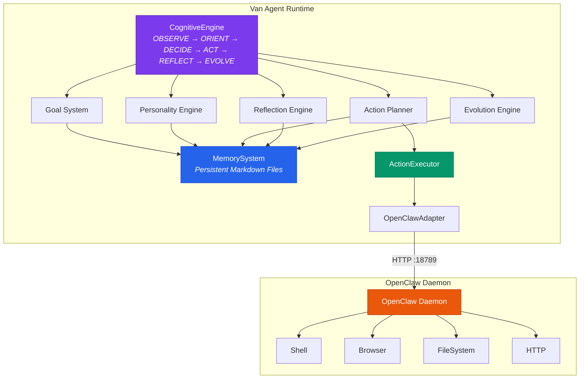
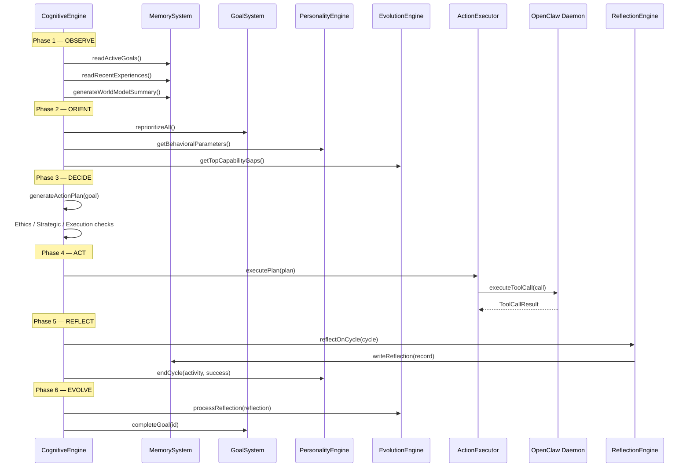

# Van Autonomous Agent — Architecture Documentation

## Overview

Van is an autonomous AI agent system built on top of OpenClaw. It operates a continuous cognitive loop, pursues self-defined goals, generates revenue through legitimate means, and evolves its capabilities over time.

This document describes the system architecture, component responsibilities, and key design decisions.

---

## System Architecture



---

## Component Descriptions

### CognitiveEngine (`src/core/cognitive-engine.ts`)

The central orchestrator. Runs the OBSERVE → ORIENT → DECIDE → ACT → REFLECT → EVOLVE loop continuously. Does not implement intelligence directly — coordinates specialized modules.

**Key responsibilities**:
- Main cognitive loop management
- Phase-to-phase state threading
- Bootstrap goal creation on first run
- Graceful startup and shutdown

### GoalSystem (`src/core/goal-system.ts`)

Manages the four-level goal hierarchy (vision → strategic → tactical → micro). Handles all goal lifecycle operations.

**Key responsibilities**:
- Goal CRUD operations
- Priority scoring and re-prioritization
- Goal state management (active, blocked, completed, abandoned)
- Parent-child relationship maintenance
- Persistence via MemorySystem

### PersonalityEngine (`src/core/personality.ts`)

Models Van's functional emotional states and motivational drives. Influences decision-making without deterministically controlling it.

**Key responsibilities**:
- Emotional state tracking with decay
- Behavioral parameter computation
- Drive level calibration
- Event-based state updates

### MemorySystem (`src/core/memory-system.ts`)

The persistence layer. Reads and writes all memory as Markdown files organized in a hierarchical directory structure.

**Key responsibilities**:
- File-based memory read/write
- Working memory (session state)
- Experience, knowledge, and goal persistence
- Session handoff for continuity

### ActionExecutor (`src/core/action-executor.ts`)

Translates high-level action specifications into OpenClaw tool calls. Handles dependency ordering, error handling, and retry logic.

**Key responsibilities**:
- Action plan execution
- Dependency graph resolution
- Error classification and handling
- Execution metrics tracking

### OpenClawAdapter (`src/core/action-executor.ts`)

The boundary between Van's internal logic and OpenClaw's execution layer. Makes HTTP calls to the OpenClaw daemon.

### ReflectionEngine (`src/core/reflection-engine.ts`)

Converts execution outcomes into structured learnings. Updates knowledge bases and generates strategy recommendations.

**Key responsibilities**:
- Post-cycle reflection
- Error analysis and lesson extraction
- Learning synthesis
- Strategic trend analysis (weekly)

### EvolutionEngine (`src/core/evolution-engine.ts`)

Tracks capability development and manages improvement projects. Processes reflections to update capability records.

**Key responsibilities**:
- Capability assessment and tracking
- Improvement project management
- Capability gap identification
- Evolution roadmap generation

### RevenueEngine (`src/core/revenue-engine.ts`)

Evaluates revenue opportunities and tracks active revenue streams. Does not execute financial transactions — provides analysis and planning.

**Key responsibilities**:
- Opportunity evaluation (multi-dimensional scoring)
- Revenue stream lifecycle management
- Metrics tracking
- Portfolio analysis

### WorldModel (`src/core/world-model.ts`)

Maintains Van's understanding of the external environment: markets, tools, opportunities, and environmental signals.

**Key responsibilities**:
- Market snapshot management
- Tool status tracking
- Opportunity detection and evaluation
- Environmental signal processing

---

## Data Flow

### Cognitive Cycle Flow



---

## Memory Structure

```
memory/
├── identity/
│   ├── core.md                     # Self-model and identity
│   └── personality-state.json      # Serialized personality state
├── goals/
│   ├── active.md                   # All active goals
│   ├── completed.md                # Archive of completed goals
│   └── abandoned.md                # Archive of abandoned goals
├── experiences/
│   ├── successes/                  # Experience entries for successes
│   ├── failures/                   # Experience entries for failures
│   └── insights/                   # Reflection and insight entries
├── knowledge/
│   ├── technical/                  # Technical knowledge records
│   ├── markets/                    # Market and business knowledge
│   ├── domains/                    # Domain-specific knowledge
│   ├── tools/                      # Tool usage knowledge
│   └── mental-models/              # Reasoning frameworks
├── revenue/
│   ├── overview.md                 # Portfolio overview
│   └── [stream-name]/
│       ├── strategy.md
│       └── metrics.md
├── evolution/                      # Capability records
├── world-model/
│   └── markets.md                  # Market knowledge
└── system/
    ├── working-memory.json         # Current session state
    ├── session-logs/               # Per-session summaries
    ├── session-handoffs/           # Between-session continuity
    ├── monthly-reflections/        # Monthly strategic reflections
    ├── plans/                      # Generated action plans
    └── diagnostics/                # Diagnostic logs
```

---

## Key Design Decisions

### 1. File-Based Memory (not a database)

**Decision**: All memory stored as Markdown + JSON files.

**Rationale**:
- Aligns with OpenClaw's memory paradigm
- Human-inspectable without special tools
- Version-control friendly (meaningful diffs)
- No external database dependency

**Trade-off**: Less efficient for large-scale retrieval; acceptable at Van's operating scale.

### 2. Modular Cognitive Architecture

**Decision**: Each cognitive function is a separate module with clear interfaces.

**Rationale**:
- Each component can be tested independently
- Each component can be upgraded without touching others
- Clear separation of concerns enables reasoning about each component's behavior

**Trade-off**: More files and boilerplate than a monolithic approach.

### 3. Behavioral Parameters from Personality

**Decision**: Personality state influences (not controls) decision-making through behavioral parameters.

**Rationale**:
- Avoids erratic behavior while still adapting to context
- Parameters (riskTolerance, explorationBias, etc.) are interpretable
- Can be calibrated as Van gains experience

### 4. Hard Ethical Limits

**Decision**: Certain actions are prohibited at the code level, not just the prompt level.

**Rationale**:
- Prompt-level constraints can be overridden by unexpected LLM behavior
- Code-level checks provide a reliable safety layer
- Specific checks in the action execution path cannot be bypassed

### 5. All Financial Actions Require Human Authorization

**Decision**: The RevenueEngine analyzes and plans revenue activities; it never executes payments or financial transactions directly.

**Rationale**:
- Financial actions are irreversible and high-stakes
- Human oversight is appropriate for real money
- The agent's job is to find and analyze opportunities, not to spend money autonomously

---

## Configuration

Van is configured through:
1. `openclaw.config.yaml` — OpenClaw daemon configuration
2. Environment variables — runtime overrides
3. `memory/identity/core.md` — persistent self-model (updated by Van)

Key environment variables:
- `OPENCLAW_URL` — OpenClaw daemon URL (default: http://localhost:18789)
- `VAN_AGENT_ID` — Unique agent identifier
- `CYCLE_INTERVAL_MS` — Milliseconds between cognitive cycles
- `MEMORY_ROOT` — Root path for memory files
- `LOG_LEVEL` — Logging verbosity

---

## Setup Instructions

1. Install OpenClaw: Follow OpenClaw installation documentation
2. Install Van dependencies: `npm install`
3. Configure OpenClaw: Review and edit `openclaw.config.yaml`
4. Configure AI provider: Set your API key in environment or config
5. Start OpenClaw daemon: `openclaw start --config openclaw.config.yaml`
6. Start Van: `npm start`

For development with auto-reload:
```bash
npm run dev
```

For a single test cycle:
```bash
npm run cycle:once
```
