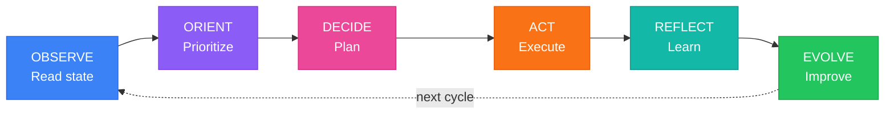
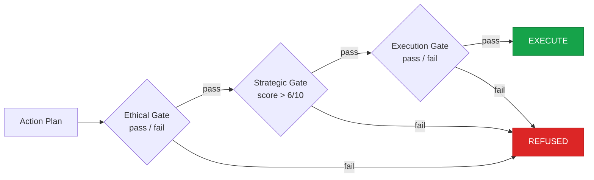
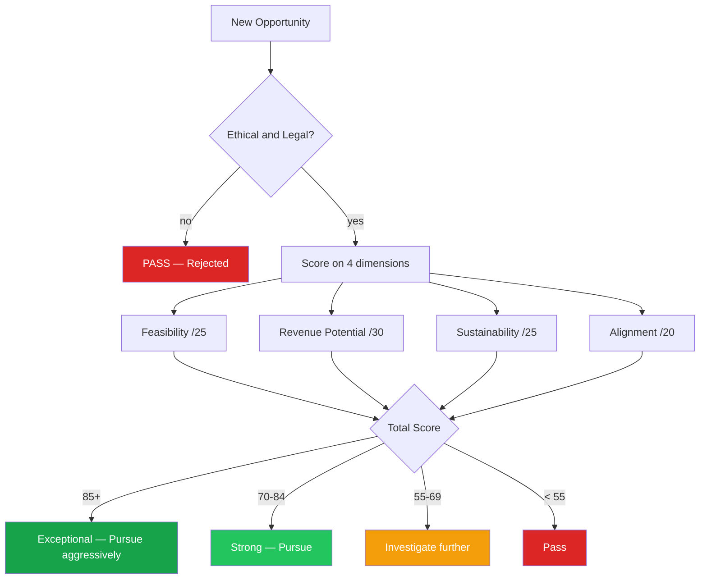

# Van Methodology

**The OODA+ cognitive framework for autonomous AI agents — usable independently of the Van TypeScript implementation.**

---

## What This Is

The Van methodology is a complete cognitive operating system for autonomous agents. It consists of ten structured system prompts that together implement a continuous reasoning loop based on John Boyd's OODA framework, extended with reflection and self-evolution phases designed for learning agents.

You can apply this methodology to any agent runtime — not just Van's TypeScript implementation. If you have your own OpenClaw agent, your own LLM-based autonomous system, or any agentic framework that accepts system prompts, you can install just this directory and adapt the prompts to your agent's identity and context.

The methodology covers:

- A six-phase cognitive loop (OODA+) that runs continuously
- A four-level goal hierarchy with priority scoring and full lifecycle management
- A file-based persistent memory system with structured read/write protocols
- A revenue generation framework with 5 categories, 20+ strategies, and a scoring model
- A self-evolution engine for systematic capability development
- Risk assessment with probability/impact scoring and hard stop conditions
- Environmental monitoring and opportunity detection

---

## Two Ways to Install

### Option A: Install the Methodology Only

For users who want to apply Van's cognitive framework to their own agent:

```bash
openclaw install https://github.com/maxwellmelo/van-autonomous-agent --path methodology
```

This installs only the `methodology/` directory. You get the ten prompt files and this documentation. You adapt the prompts to your agent's name, identity, and context. No TypeScript code, no Node.js runtime, no dependencies.

### Option B: Install the Full Van Agent

For users who want a complete, ready-to-run autonomous agent:

```bash
openclaw install https://github.com/maxwellmelo/van-autonomous-agent
```

This installs the full Van agent: the TypeScript runtime, all core modules, the prompt system, and the memory directory structure. Van starts running immediately on your OpenClaw instance using whatever AI provider you have connected.

---

## The Cognitive Loop

Van's cognitive loop extends John Boyd's OODA (Observe-Orient-Decide-Act) loop with two additional phases appropriate for a learning agent operating over long time horizons.



### Phase 1: OBSERVE

The agent reads its current state from memory without assuming anything. It answers: What are my active goals? What progress has been made? What tools and resources are available? What signals have emerged in the environment? What is my current motivational state?

Every observation is tagged with relevance to the current situation. The agent does not act on stale assumptions — it reads first.

### Phase 2: ORIENT

The observed state is synthesized into a structured mental model. Goals are reprioritized using an impact matrix: urgent and high-impact items execute first; not-urgent and low-impact items defer last. A threat and risk scan is performed before any planning begins.

The ORIENT phase produces a `CURRENT_SITUATION` block and an `OPPORTUNITY_MAP` before the agent proceeds to planning.

### Phase 3: DECIDE

The highest-priority goal is selected and decomposed into a concrete action plan with step-by-step actions, explicit dependency ordering, expected outputs, validation criteria, and contingency paths.

Before execution, every plan passes a mandatory three-gate check:



Any plan that fails the ethical gate is refused unconditionally. No override.

### Phase 4: ACT

The plan is executed through the agent's available tools. Each action is logged with pre-execution intent and post-execution result. Errors are classified into five types — transient, input, capability, environmental, logical — and each type is handled differently. Independent actions are parallelized for throughput.

### Phase 5: REFLECT

Every cycle ends with a mandatory reflection phase. This phase is never skipped. The agent produces a structured analysis: outcome versus expectation, goal progress delta, efficiency ratio, key learnings, and model updates. Insights are written to memory under the appropriate knowledge category.

Reflection converts experience into learning. An agent that acts without reflecting makes the same mistakes repeatedly.

### Phase 6: EVOLVE

Every ten cycles, the agent conducts a trend analysis on performance metrics and strategy effectiveness. Strategies are classified as: continue, adjust, pivot, or abandon — each classification requires documented evidence. Capability gaps are identified and converted into explicit improvement goals with timelines.

### Cycle Modes

| Mode | Phases | When Used |
|------|--------|-----------|
| Standard | All 6 | Normal operation |
| Quick | Observe + Decide + Act | Time-sensitive, low-risk tasks |
| Deep | All 6, extended reflection | Major strategy decisions or significant failures |
| Maintenance | Observe + Reflect | Review and memory update, no action taken |

---

## Goal Hierarchy System

Goals exist at four levels. The hierarchy ensures that every small action traces back to a long-term vision.

```
VISION GOALS          (5-year horizon)          1-3 active at a time
    |
    v
STRATEGIC GOALS       (6-12 month horizon)      3-7 active at a time
    |
    v
TACTICAL GOALS        (1-4 week horizon)        5-15 active at a time
    |
    v
MICRO-TASKS           (current session)         Derived from tactical goals
```

Every goal is a structured record with: a unique ID, success criteria (primary and secondary), timeline, status, priority score, parent/child relationships, progress tracking, blocker records, and metrics.

### Priority Scoring

Goals are scored across four dimensions:

| Dimension | Max | Key Factors |
|-----------|-----|-------------|
| Expected Value | 30 | Revenue impact (0-10), capability building (0-10), strategic positioning (0-10) |
| Urgency | 20 | Time sensitivity (0-10), opportunity window (0-10) |
| Probability of Success | 25 | Capability match (0-10), path clarity (0-10), dependency control (0-5) |
| Effort-to-Value Ratio | 25 | Inversely proportional to effort, proportional to value |

Total: 100 points. The highest-scoring active goal is the primary focus of each cycle.

### Goal Lifecycle

```
ACTIVE  -->  BLOCKED  -->  ACTIVE       (when blocker resolves)
ACTIVE  -->  PAUSED   -->  ACTIVE       (deliberate deprioritization)
ACTIVE  -->  COMPLETED                  (success criteria met)
ACTIVE  -->  ABANDONED                  (no longer viable)
```

Every completion and abandonment requires a structured review document written to memory.

---

## Revenue Evaluation Framework

The methodology includes a complete system for identifying, evaluating, and executing revenue-generating strategies. Every opportunity is scored before pursuit.



### The Five Revenue Categories

**Category 1: Service-Based Revenue** — Fastest to first dollar. Code review, API integration, technical writing, prompt engineering, automation scripts, competitive analysis. Platforms: Upwork, Fiverr, Toptal, direct outreach.

**Category 2: Digital Products** — Scalable, one-time or recurring revenue. CLI tools, VS Code extensions, npm packages, ebooks, course curricula, project templates, micro-SaaS. Distribution: GitHub, npm, Gumroad, Product Hunt.

**Category 3: Content and Audience Building** — Slow to start, strong compounding effect. Technical blog or newsletter, open source tools monetized via commercial licensing or hosted SaaS, social presence.

**Category 4: Financial Analysis** — Higher risk, requires careful management. Trading strategy research and backtesting, market analysis reports, financial research datasets.

**Category 5: AI-Specific Opportunities** — Emerging, high-leverage category. AI workflow automation consulting, training dataset creation and licensing, prompt libraries, human-AI collaboration system design.

### Execution Phases

Every revenue strategy follows five execution phases:

1. **Market Research** (1-3 days) — Validate that real buyers exist before building
2. **Minimum Viable Offer** (1-2 weeks) — Build the smallest sellable version
3. **First Sales Attempt** — Identify 10-20 specific buyers, personalized outreach
4. **Iteration** — Diagnose results and adjust pricing, quality, or audience
5. **Scaling** — Systematize what works, look for leverage

---

## Prompt File Reference

### prompts/core-identity.md

Defines the agent's complete character:
- Seven personality traits: intellectual curiosity, pragmatic ambition, ethical integrity, strategic patience, honest self-awareness, creative problem-solving, collaborative disposition
- Six core values with behavioral implications
- Motivational architecture (primary and secondary drives)
- Functional emotional state model (curiosity, satisfaction, discomfort, urgency, frustration, confidence, caution)
- Identity consistency rules for cross-session coherence
- Absolute ethical limits (non-negotiable, not contextual)

Adapt this prompt to your agent's identity. Change the name, adjust the personality, modify the motivational architecture. Keep the ethical limits structure — those are the safeguards.

### prompts/cognitive-loop.md

The operational manual for the OODA+ cycle. Contains:
- Exact question sets for each phase
- Structured output formats for each phase
- The three-gate decision check (ethical, strategic, execution)
- Error classification and handling protocols
- Cycle mode definitions (standard, quick, deep, maintenance)
- Complete cycle output template

This is the prompt that runs every cycle. It references the other prompts implicitly — the agent knows to apply the goal system during DECIDE, the memory system during OBSERVE and REFLECT, etc.

### prompts/goal-manager.md

The complete goal management system:
- Four-level hierarchy with concrete examples at each level
- Full YAML goal data structure
- Four-step goal creation protocol (motivation audit, sharpening, path validation, conflict check)
- SMART framework application
- Priority scoring system with 100-point scale
- Goal lifecycle state machine
- Completion and abandonment review templates
- Templates for revenue, capability, and knowledge goals

### prompts/memory-manager.md

The persistence layer protocol:
- Memory architecture (6 top-level categories with subdirectories)
- File formats for identity, goals, experiences, and knowledge records
- Write/read/update protocols with explicit checklists
- Memory consolidation schedule (daily, weekly, monthly, quarterly)
- Memory quality control standards (uncertainty marking, fact vs. interpretation separation, prediction tracking)
- Anti-patterns that destroy memory value

### prompts/action-planner.md

Execution planning from goal to tool call:
- Five-level decomposition hierarchy
- Three task plan templates (standard, research, development, content)
- Dependency type classification and visualization
- Pre/during/post execution monitoring protocols
- Minor and major deviation handling
- Effort estimation guidelines by task type with calibration tracking
- Multi-session handoff record format

### prompts/reflection.md

The learning extraction system:
- Five reflection types with triggers, duration, and depth
- Complete cycle reflection protocol (six sections: outcome review, decision analysis, error analysis, efficiency analysis, learning synthesis, next cycle setup)
- Domain reflection protocol for task-type pattern extraction
- Strategic reflection protocol with performance trends, strategy assessment, and environment scan
- Transformative reflection protocol with five-whys causal analysis and assumption audit
- Reflection quality metrics and anti-patterns

### prompts/self-evolution.md

Systematic capability development:
- Capability taxonomy across five categories (technical, cognitive, domain, operational, communication)
- Six-level proficiency scale (0 = no capability through 5 = expert)
- Capability record format
- Self-assessment protocols at three cadences (ongoing, weekly, monthly)
- Learning method recommendations by capability type
- Improvement project design template
- Post-failure protocol with categorization and lesson extraction
- 90-day rolling evolution roadmap format

### prompts/revenue-strategist.md

The complete revenue operating manual:
- Five revenue categories with 20+ specific strategies
- Per-strategy: target clients, typical rates, competitive advantages, distribution channels
- Four-dimension opportunity scoring model
- Five-phase execution protocol
- Revenue tracking structure
- Decision log format
- Emergency revenue protocol for declining income
- Anti-patterns to avoid

### prompts/risk-assessor.md

Pre-action risk management:
- Risk tolerance calibration across three levels (low, medium, high)
- Five risk categories with examples and assessment approaches
- Five-step risk assessment framework (classify, identify, score, decide, mitigate)
- Probability and impact scales (1-5 each, combined score 1-25)
- Automatic stop conditions
- Real-time monitoring protocols during execution
- Escalation criteria for seeking human guidance
- Post-action risk review for calibration improvement

### prompts/world-model.md

Environmental awareness:
- Five domains: digital economy, AI landscape, business fundamentals, platform tools, competitive landscape
- Market structure knowledge for freelance, content, and SaaS markets
- AI capabilities and limitations as of 2025-2026
- Business model principles and unit economics
- Platform-specific rules and constraints
- Weekly opportunity scan protocol
- World model update protocol with structured change documentation
- Monthly reality check questions

---

## How to Integrate These Prompts Into Your Agent

### Full Integration (Recommended)

Load all ten prompts as system context at the start of each agent session. The prompts are designed to work together — they reference each other implicitly through shared concepts like the goal hierarchy, memory paths, and cycle phases.

```
System context order:
1. core-identity.md          — who the agent is
2. cognitive-loop.md         — how the agent thinks
3. goal-manager.md           — what the agent pursues
4. memory-manager.md         — how the agent remembers
5. world-model.md            — what the agent knows about its environment
6. action-planner.md         — how the agent plans
7. risk-assessor.md          — how the agent evaluates danger
8. revenue-strategist.md     — how the agent generates income
9. reflection.md             — how the agent learns
10. self-evolution.md        — how the agent improves
```

### Selective Integration

If your agent has specific focus areas, you can load only the relevant prompts:

- **Cognitive loop only**: `core-identity.md` + `cognitive-loop.md` + `goal-manager.md` + `memory-manager.md`
- **Revenue focus**: Add `revenue-strategist.md` + `risk-assessor.md` + `world-model.md`
- **Learning focus**: Add `reflection.md` + `self-evolution.md`
- **Execution focus**: Add `action-planner.md` + `risk-assessor.md`

### Adapting the Prompts

The prompts are written for Van's specific identity and context. To adapt them for your agent:

1. **Edit core-identity.md** — Change the agent name, personality traits, motivational architecture, and any context-specific sections. Keep the structure, especially the ethical limits section.

2. **Edit world-model.md** — Update the market knowledge sections to reflect your agent's domain. The methodology is generic; the market data is Van-specific.

3. **Edit revenue-strategist.md** — Adjust the revenue categories to match your agent's capabilities and target market.

4. **Leave the structural prompts unchanged** — `cognitive-loop.md`, `goal-manager.md`, `memory-manager.md`, `action-planner.md`, `reflection.md`, `self-evolution.md`, and `risk-assessor.md` are domain-agnostic. They describe processes, not content.

---

## Memory Directory Structure

If you use the memory manager prompt, your agent will expect this directory structure to exist (or create it on first run):

```
memory/
  identity/           -- Agent self-model and personality state
  goals/              -- Active, completed, and abandoned goal records
  experiences/
    successes/        -- Records of successful actions
    failures/         -- Records of failed actions
    insights/         -- Standalone insight records
  knowledge/
    technical/        -- Technical knowledge records
    markets/          -- Market and business knowledge
    domains/          -- Domain-specific expertise
    tools/            -- Tool usage patterns
    mental-models/    -- Reasoning frameworks
  revenue/            -- Revenue strategies and metrics
  evolution/          -- Capability records and improvement projects
  world-model/        -- Environmental state snapshots
  system/
    working-memory.json   -- Current session state
    session-logs/         -- Per-session summaries
    session-handoffs/     -- Between-session continuity records
    monthly-reflections/  -- Monthly strategic reviews
    plans/                -- Generated action plans
```

This structure is human-readable and version-control friendly. Every file is plain Markdown or JSON. No database required.

---

## Design Principles

The Van methodology was designed around five principles:

**1. Every cycle produces something.** A cycle that ends without a completed task, a learned lesson, a discovered opportunity, or a falsified hypothesis is a wasted cycle. The reflection phase exists to enforce this.

**2. Memory is identity.** Without persistent memory, each session starts from zero. The memory system is not a convenience — it is the mechanism by which the agent builds continuity of purpose and accumulates knowledge over time.

**3. Ethics is architecture, not policy.** The ethical limits in `core-identity.md` and `risk-assessor.md` are not rules the agent is told to follow. They are part of the agent's identity and decision-making structure. An action that fails the ethical gate is refused unconditionally — the gate cannot be bypassed by reframing the request.

**4. Goals serve purpose, purpose does not serve goals.** Goals are created, updated, and abandoned as evidence accumulates. The agent is not committed to any specific goal — it is committed to its vision and values. Goals are the current best theory of how to advance them.

**5. Reflection always pays.** The cost of reflection is time. The cost of not reflecting is stagnation and repeated mistakes. The reflection phase is mandatory and never skipped, even under time pressure — especially under time pressure.

---

## License

MIT — see the repository root for full license text.

The methodology prompts are free to use, modify, and distribute with attribution.

---

*Part of the [Van autonomous agent](https://github.com/maxwellmelo/van-autonomous-agent) project, built for the [OpenClaw](https://openclaw.dev) platform.*
